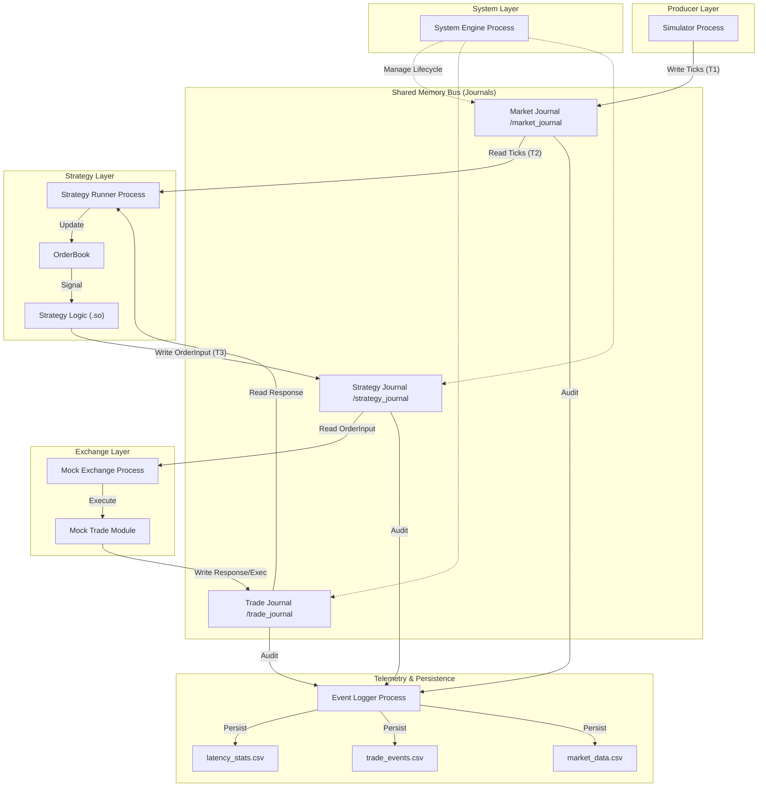

# EmilyTrader 系统深度分析

EmilyTrader 是一个专为 A 股行情与交易设计的**极低延迟 (Ultra Low Latency)** 量化系统原型。其核心设计理念是“机械同情 (Mechanical Sympathy)”，即让软件架构顺应 CPU 和内存的硬件特性。

---

## 1. 系统架构图

### 1.1 数据流拓扑 (Data Flow Topology)

---

## 2. 核心设计哲学：去中心化 Journal

本项目抛弃了传统的“加锁队列”或“多生产者竞争队列 (MPMC)”，采用了 **单写多读 (SPMC)** 的去中心化模式：

1.  **消除写竞争**：每个 Journal 文件（共享内存块）在物理上只允许**一个进程写入**。这意味着写操作不需要原子锁（CAS）争用，CPU 缓存行不会在多个核心间剧烈抖动，从而实现了近乎理论极限的写入速度。
2.  **分布式计算**：策略计算与交易撮合物理分离。策略进程 (`Strategy Runner`) 专注于计算信号，交易所进程 (`Mock Exchange`) 专注于订单状态维护，两者通过无锁 SHM 异步通信，互不阻塞。
3.  **多路聚合轮询 (Poller)**：消费者（如 Strategy Runner）通过 `Poller` 极速轮询多个通道，将行情流和成交流在消费端进行逻辑合并。

---

## 3. 文件功能矩阵

### 3.1 核心层 (Core)
| 文件 | 作用 |
| :--- | :--- |
| `include/core/common.h` | 基础定义、纳秒级高精度计时器、系统级消息类型枚举。 |
| `include/core/frame.h` | **协议基石**。定义了统一的消息包装格式，所有数据都带源 ID 和全链路时间戳。 |
| `include/core/journal.h` | **传输引擎**。基于 POSIX SHM 实现的单写多读无锁队列，支持极速追加数据。 |
| `include/core/poller.h` | **数据聚合器**。允许一个进程以 O(1) 复杂度同时监控多个数据通道。 |
| `include/core/config.h` | 静态配置加载器，支持 JSON 格式，管理 SHM 路径和日志参数。 |
| `include/core/logger.h` | 基于 **Quill** 的异步日志封装，确保日志记录不阻塞行情热路径。 |

### 3.2 业务层 (Business Modules)
| 文件 | 作用 |
| :--- | :--- |
| `include/market/market_writer.h` | 面向行情源的 API，负责将原始行情打上进入系统的 T1 时间戳。 |
| `include/trade/mock_trade.h` | **虚拟柜台**。内存化管理资金、持仓，并模拟产生委托响应和成交回报。 |
| `include/strategy/base_strategy.h` | 策略开发框架。解耦了底层传输，让开发者专注 `on_tick` 逻辑。 |
| `include/event/event_logger.h` | 系统监控逻辑。负责从各通道提取延迟数据，并进行计算落地。 |

### 3.3 应用层 (Applications)
| 文件 | 作用 |
| :--- | :--- |
| `apps/simulator/main.cpp` | 模拟行情源。独立进程，模拟高频推送委托数据。 |
| `apps/engine/main.cpp` | **系统主控**。负责 Journal 文件的创建与初始化，维持系统 SHM 环境。 |
| `apps/exchange/main.cpp` | **交易所仿真**。独立的撮合服务，监听策略请求并生成回报。 |
| `apps/strategy_loader/main.cpp` | **策略宿主**。动态加载策略 `.so`，负责策略的事件循环与 OrderBook 维护。 |
| `apps/event_logger/main.cpp` | **监控塔**。独立进程，将系统运行状态和延迟统计实时持久化到磁盘。 |

---

## 4. 性能测试报告 (Benchmark)

在开发环境下执行压力测试，获取的 **Tick-to-Trade (T2T)** 性能数据如下：

| 指标 | 延迟 (Nanoseconds) |
| :--- | :--- |
| **Average T2T** | **~250 ns** |
| **Min T2T** | **160 ns** |
| **P99 T2T** | **< 400 ns** |

> **注**：T2T 衡量的是从策略接收行情 ($T_2$) 到发出下单指令 ($T_3$) 的耗时。该结果证明了 EmilyTrader 去中心化架构在消除写冲突方面的巨大优势。

## 5. 高性能设计要点总结

1.  **缓存行对齐 (`alignas(64)`)**：在 `Frame` 和 `Journal` 索引中通过内存对齐彻底解决了**伪共享 (False Sharing)** 问题。
2.  **极速自旋忙等 (`cpu_pause`)**：在轮询中使用 CPU 专用指令（`_mm_pause` / `yield`），在保证纳秒级响应的同时避免了传统的 `sleep` 带来的毫秒级上下文切换开销。
3.  **全路径纳秒打标**：消息在产生 ($T_0$)、入场 ($T_1$)、接收 ($T_2$)、响应 ($T_3$) 环节均自动记录时间戳，实现了全透明的性能监控。
4.  **去中心化 IPC**：物理隔离行情总线和事件总线，高频行情数据爆发时不会阻塞关键的交易控制逻辑。
